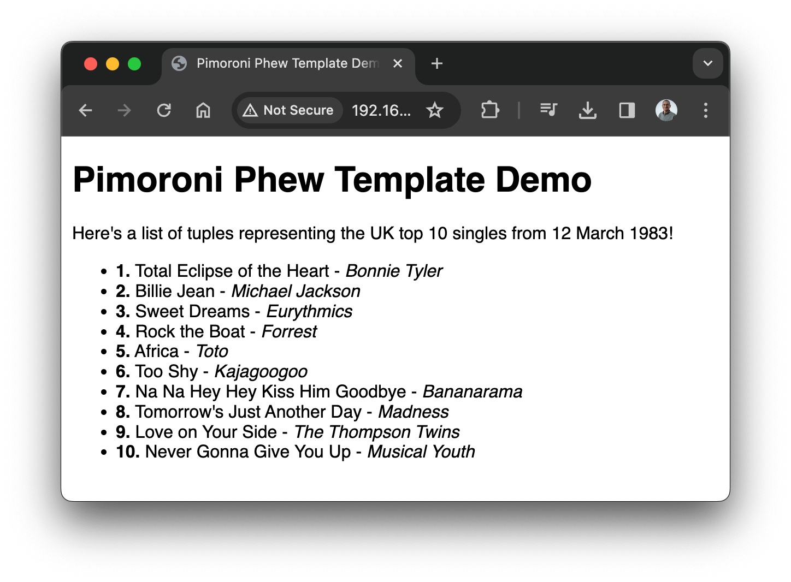

# Pimoroni Phew Template Demo

A very small demo showing how to use MicroPython code to loop over data structures in a [Pimoroni Phew](https://github.com/pimoroni/phew) template.

This has been tested on a [Raspberry Pi Pico W](https://www.raspberrypi.com/documentation/microcontrollers/raspberry-pi-pico.html) running [MicroPython v1.22.1](https://micropython.org/download/RPI_PICO_W/).

It uses UK top 10 singles data from 1983.  Here's what it looks like when working:

## Installation

* Install MicroPython on the Raspberry Pi Pico W ([get the installer here](https://micropython.org/download/RPI_PICO_W/)).
* Edit `config.py` to add your WiFi SSID and password.
* Copy the following files to the root of the device (there's a few ways of doing this, you could use [Thonny](https://thonny.org/) or [mpremote](https://docs.micropython.org/en/latest/reference/mpremote.html)):
  * `main.py`
  * `config.py`
  * `phew` (folder)
  * `templates` (folder)

## Running the Demo

* Having completed the above installation steps, reset the Pico W.
* It should start and connect to your WiFi and print its IP address to the MicroPython console.
* Using your browser, go to `http://<pico w ip address>/` to see the output.

## How it Works

TODO explain this!